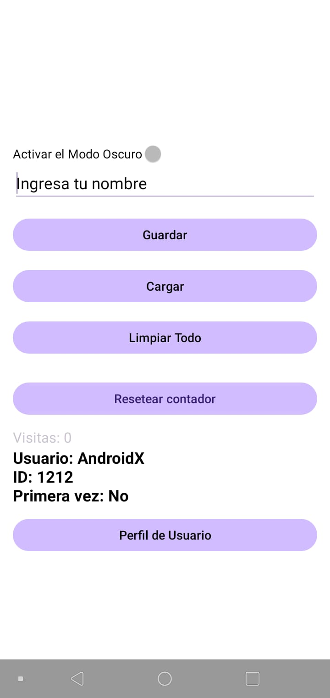
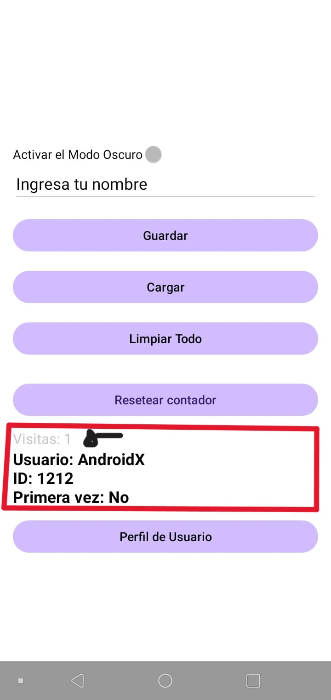
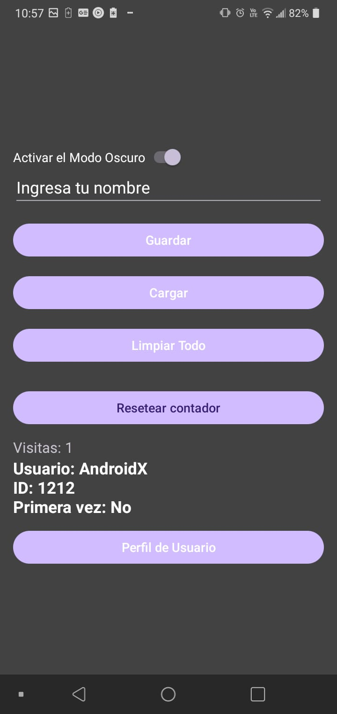
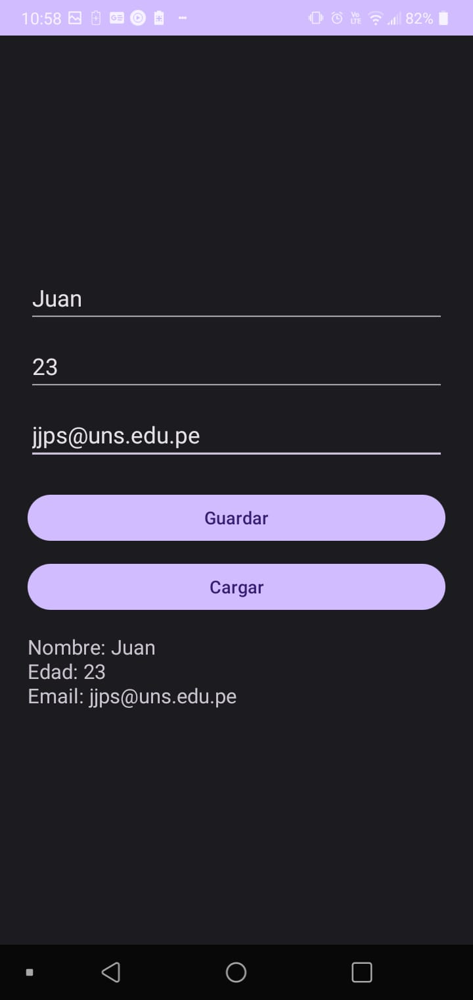

# App S9 - SharedPreferences Demo

Aplicación Android de ejemplo que demuestra el uso básico de SharedPreferences para almacenamiento persistente de datos.

## 📱 Descripción

Esta aplicación implementa un sistema simple de SharedPreferences que permite:
- Guardar y recuperar datos de usuario
- Detectar la primera ejecución de la app
- Limpiar todas las preferencias guardadas

## 🚀 Características

- **SharedPreferencesHelper**: Clase wrapper para simplificar el uso de SharedPreferences
- **Tipos de datos soportados**: String, Boolean, Int, Float, Long
- **Interfaz simple**: Campos de entrada y botones para interactuar con las preferencias
- **Persistencia**: Los datos se mantienen incluso después de cerrar la aplicación

## 📋 Requisitos

- Android Studio Arctic Fox o superior
- SDK mínimo: API 21 (Android 5.0)
- SDK objetivo: API 34 (Android 14)
- Kotlin 1.9.0

## 🧩 Funcionalidades implementadas

### ✅ Actividad Principal (`MainActivity`)
- Guarda nombre de usuario y genera ID aleatorio.
- Verifica si es la primera vez que se abre la app.
- Muestra un contador de visitas (se incrementa al abrir la app).
- Permite limpiar todos los datos almacenados.
- Cambio dinámico de Modo Claro / Modo Oscuro mediante `Switch`.
- Acceso a perfil de usuario.

## 📄 Licencia

Este proyecto es de código abierto y está disponible bajo la Licencia MIT.
